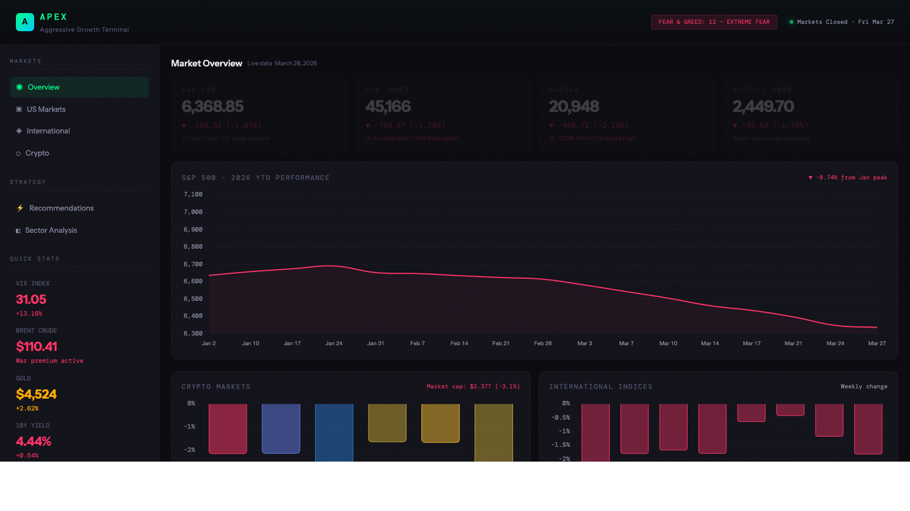

# APEX — Aggressive Growth Terminal


A full-stack market intelligence dashboard for tracking US equities, international indices, crypto, sector analysis, and high-conviction investment recommendations.




---

## Architecture

```
apex-dashboard/
├── backend/          # Go REST API (net/http, no framework)
│   ├── cmd/server/   # Entrypoint — wires config, store, handlers, server
│   └── internal/
│       ├── config/       # Environment config (APEX_ADDR)
│       ├── handlers/     # HTTP handlers — one file per endpoint
│       ├── middleware/   # CORS middleware
│       ├── models/       # JSON response types
│       ├── repository/   # Store interface + static implementation
│       └── server/       # HTTP server with graceful shutdown
└── frontend/         # React 18 + TypeScript + Vite
    └── src/
        ├── components/   # Header, Sidebar, LoadingState, ErrorState
        ├── hooks/        # useOverview, useMarkets, useCrypto, useRecommendations
        ├── pages/        # Overview, USMarkets, International, Crypto, Recommendations, Sectors
        ├── services/     # API client — all fetch calls live here
        └── types/        # TypeScript interfaces matching backend response shapes
```

### Backend

- **Language**: Go 1.22+ using only the standard library (`net/http`)
- **Pattern**: Dependency injection via struct fields — no global state
- **API**: RESTful routes at `/api/v1/*`; all responses wrapped in `{"data": {...}}`; errors use `{"error": {"code": "...", "message": "..."}}`
- **Data**: Currently served from a static in-memory store (`internal/repository/static`). Swap to a live data source by implementing the `repository.Store` interface
- **Shutdown**: Graceful 10-second drain via `context.Context` + OS signal handling

### Frontend

- **Stack**: React 18 · TypeScript (strict mode) · Vite · Tailwind CSS v3
- **Styling**: Custom dark terminal theme — no CSS modules, no inline style objects
- **Data fetching**: `services/market.ts` handles all API calls and unwraps the `{"data": T}` envelope; hooks in `hooks/useMarketData.ts` manage loading/error state
- **Code splitting**: All six page components are lazy-loaded with `React.lazy` + `<Suspense>`
- **Charts**: Chart.js via `react-chartjs-2` (line, bar charts)

---

## Running Locally

### Prerequisites

- Go 1.22+
- Node.js 18+

### 1. Start the backend

```bash
cd backend
go run ./cmd/server
# Listening on :8080 by default
```

Set `APEX_ADDR` to use a different port:

```bash
APEX_ADDR=:9000 go run ./cmd/server
```

### 2. Start the frontend

```bash
cd frontend
npm install
npm run dev
# Open http://localhost:5173
```

The Vite dev server proxies `/api/*` requests to `http://localhost:8080`, so no CORS configuration is needed during development.

---

## Testing

### Backend

```bash
cd backend

# Run all tests
go test ./...

# Run with race detector
go test -race ./...

# Run with coverage report
go test -coverprofile=coverage.out ./internal/... && go tool cover -func=coverage.out
```

### Frontend

```bash
cd frontend

# Run tests (watch mode)
npm test

# Run tests once
npm run test:coverage

# View coverage summary
npm run test:coverage -- --reporter=text
```

---

## API Endpoints

| Method | Path | Description |
|--------|------|-------------|
| GET | `/api/v1/overview` | Market indices, quick stats, chart data |
| GET | `/api/v1/markets` | US movers, international indices, sector data |
| GET | `/api/v1/crypto` | Crypto assets, BTC price history |
| GET | `/api/v1/recommendations` | Curated investment picks by category |

All responses follow the envelope format:

```json
{ "data": { ... } }
```

Errors:

```json
{ "error": { "code": "UNAVAILABLE", "message": "data unavailable" } }
```

---

## Production Build

### Backend

```bash
cd backend
go build -o bin/server ./cmd/server
./bin/server
```

### Frontend

```bash
cd frontend
npm run build
# Output in frontend/dist/ — serve with any static file host
```

For a combined deployment, serve `frontend/dist/` from a CDN or static host and point the frontend's API base URL at the backend server. When self-hosting both on the same origin, you can serve `dist/` directly from the Go server by adding a file server handler for non-`/api` routes.

### Environment Variables

| Variable | Default | Description |
|----------|---------|-------------|
| `APEX_ADDR` | `:8080` | Address the backend listens on |

Frontend (Vite, prefix with `VITE_`):

| Variable | Default | Description |
|----------|---------|-------------|
| `VITE_API_BASE_URL` | *(proxied in dev)* | Override API base URL for production builds |

---

## Deployment on GCP Cloud Run

### Prerequisites

- Google Cloud SDK (`gcloud`) installed and authenticated
- GCP project with Cloud Run API enabled
- Docker installed locally (for testing)

### 1. Build and Test Locally

```bash
# Build the Docker image
docker build -t apex-dashboard .

# Test locally
docker run -p 8080:8080 -e POLYGON_API_KEY=your-key -e COINGECKO_API_KEY=your-key apex-dashboard
```

### 2. Deploy to Cloud Run

#### Option A: Manual Deployment

```bash
# Set your GCP project
gcloud config set project YOUR_PROJECT_ID

# Build and deploy
gcloud run deploy apex-dashboard \
  --source . \
  --platform managed \
  --region us-central1 \
  --allow-unauthenticated \
  --set-env-vars POLYGON_API_KEY=YOUR_POLYGON_KEY,COINGECKO_API_KEY=YOUR_COINGECKO_KEY \
  --port 8080
```

#### Option B: Automated with Cloud Build

1. Enable Cloud Build API in your GCP project
2. Create a Cloud Build trigger for your repository
3. Set substitution variables `_POLYGON_API_KEY` and `_COINGECKO_API_KEY` in the trigger
4. Push to trigger automatic build and deployment

The service will be accessible at the URL provided by Cloud Run.

### Environment Variables for Production

| Variable | Required | Description |
|----------|----------|-------------|
| `POLYGON_API_KEY` | Yes | Polygon.io API key for market data |
| `COINGECKO_API_KEY` | No | CoinGecko API key for higher rate limits |
| `APEX_ADDR` | No | Listen address (defaults to `:8080`) |

---

## Verification

```bash
# Backend
cd backend
go test ./...
go build ./...

# Frontend
cd frontend
npm test -- --run   # all tests
npx tsc --noEmit    # type-check
npm run lint
npm run build
```
